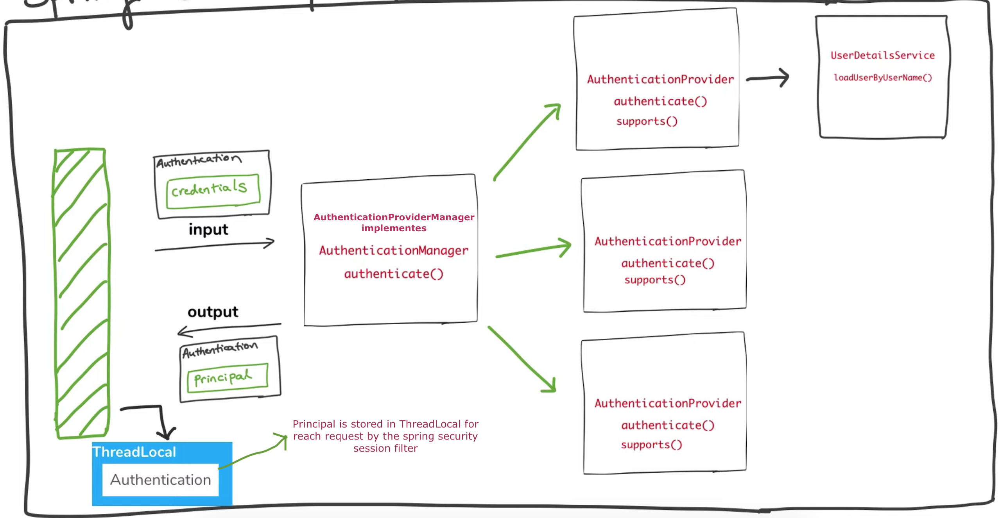

# How does authentication work in Spring Security?

# spring-jdbc-authentication

#### This project is to learn user authentication using JDBC (user details are saved in a database)

### Dependencies
* Spring web starter
* Spring security starter
* H2 database (in memory) or any other DB
* JDBC API

### Use case
* Home Page (Open to all)
* User Page (Open to authenticated users only)
* Admin Page (Open to authenticated users and admins only)

